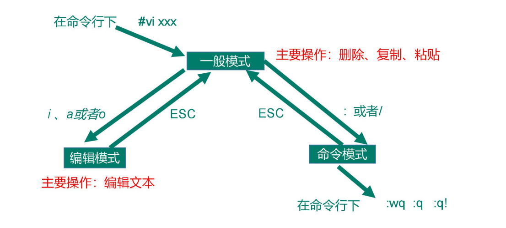

# linux学习笔记 (以下文档参考于尚硅谷学院教程，如果有侵权，请联系删除 )
## 一、VI/VIM 编辑器
### (1)一般模式
以 vi 打开一个档案就直接进入一般模式了（这是默认的模式）。在这个模式中， 你可以使用『上下左右』按键来移动光标，你可以使用『删除字符』或『删除整行』来处理档案内容， 也可以使用『复制、粘贴』来处理你的文件数据。 
语法 功能描述  
yy 复制光标当前一行  
y 数字 y 复制一段（从第几行到第几行）  
p 箭头移动到目的行粘贴  
u 撤销上一步  
dd 删除光标当前行  
d 数字 d 删除光标（含）后多少行  
x 剪切一个字母，相当于 del  
X 剪切一个字母，相当于 Backspace  
yw 复制一个词  
dw 删除一个词  
shift+6（^） 移动到行头  
shift+4 （$） 移动到行尾  
1+shift+g 移动到页头，数字  
shift+g 移动到页尾  
数字+shift+g 移动到目标行  

  
### (2)编辑模式  
在一般模式中可以进行删除、复制、粘贴等的动作，但是却无法编辑文件内容的！要等到你按下『i, I, o, O, a, A』等任何一个字母之后才会进入编辑模式。注意了！通常在Linux中，按下这些按键时，在画面的左下方会出现『INSERT或REPLACE』的字样，此时才可以进行编辑。而如果要回到一般模式时， 则必须要按下『Esc』这个按键即可退出编辑模式。  

1）进入编辑模式  
表4-2 常用语法  
按键 功能  
i 当前光标前  
a 当前光标后  
o 当前光标行的下一行  
I 光标所在行最前  
A 光标所在行最后  
O 当前光标行的上一行  
2）退出编辑模式  
按『Esc』键 退出编辑模式，之后所在的模式为一般模式。  

### (3)指令模式
在一般模式当中，输入『 : / ?』3个中的任何一个按钮，就可以将光标移动到最底下那一行。在这个模式当中， 可以提供你『搜寻资料』的动作，而读取、存盘、大量取代字符、离开 vi 、显示行号等动作是在此模式中达成的  
1）基本语法
表4-3
命令 功能  
:w 保存  
:q 退出  
:! 强制执行  
/要查找的词 n 查找下一个，N 往上查找  
:noh 取消高亮显示  
:set nu 显示行号  
:set nonu 关闭行号  
:%s/old/new/g 替换内容 /g 替换匹配到的所有内容  
2）案例实操  
（1）强制保存退出  
:wq!  

